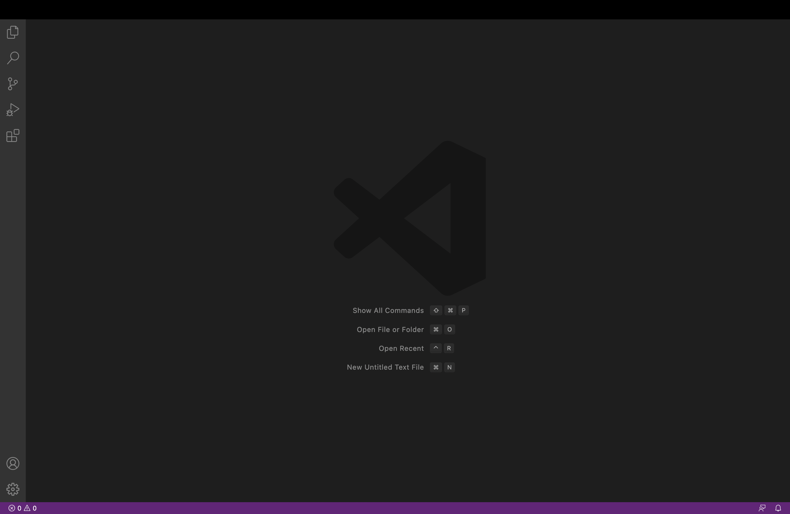
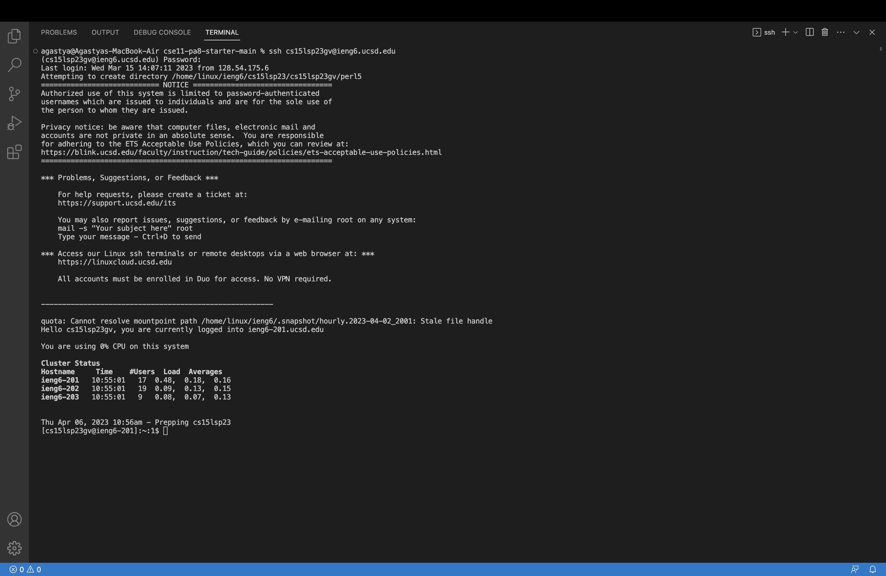
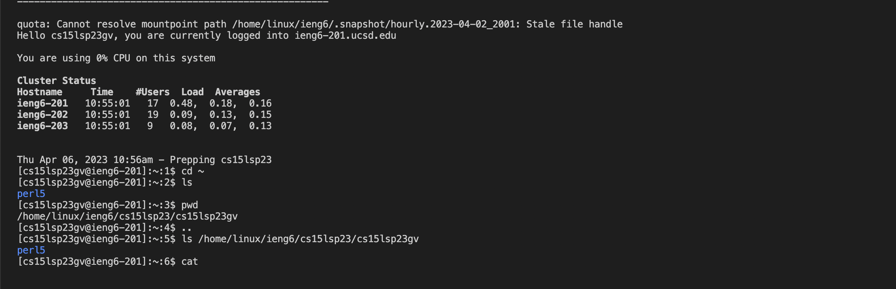

Lab Report 1 - Remote Access and FileSystem (Week 1)

Step 1: Installing VS code

Go to the Visual Studio Code website https://code.visualstudio.com/, and follow the steps to download. The image below shows what VS code will look like after successful installation.

Step 2: Remotely Connecting

Open Terminal and type in the following:  ssh cs15lsp23gv@ieng6.ucsd.edu. A prompt will come up allowing you to enter your account password. Now type in your password (there is no indication while typing) and it should work.

Step 3: Trying some Commands

Test some commands like cd, ls, pwd, mkdir.

