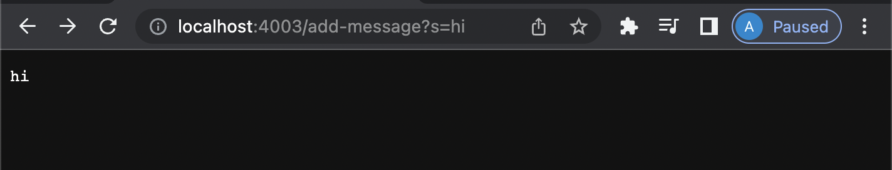
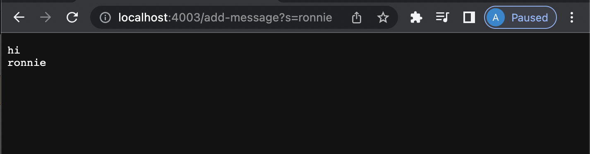
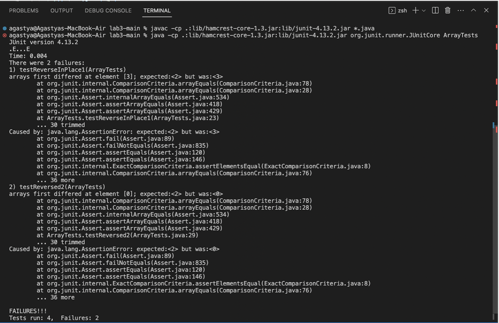

# **Lab Report 2 - Server and Bugs (Week 3)**

**Part 1:** String Server
This part of the lab report required me to create a new server called StringServer. When the path of the URL is changed, a string is displayed on the web page. If we further change the path of the URL, a new string is displayed in the next line along with the previous string. The image attached below shows my code for the ```StringServer``` class. These classes are similar to the files that we worked with in Lab while creating ```NumberServer```.

```import java.io.IOException;
import java.net.URI;

class StringHandler implements URLHandler 
{

    int num = 0;
    String newString = "";

    public String handleRequest(URI url) 
    {
        if (url.getPath().equals("/")) 
        {
            return "";
        }
        else 
        {
            System.out.println("Path: " + url.getPath());
            if (url.getPath().contains("/add-message")) 
            {
                String[] parameters = url.getQuery().split("=");
                if (parameters[0].equals("s")) 
                {
                    newString += parameters[1] +"\n";
                     
                }
                return newString;
            }
            return "404 Not Found!";
        }
    }
}

class StringServer 
{
    public static void main(String[] args) throws IOException 
    {
        if(args.length == 0){
            System.out.println("Missing port number! Try any number between 1024 to 49151");
            return;
        }

        int port = Integer.parseInt(args[0]);

        Server.start(port, new StringHandler());
    }
}
```
**Implementation of /add-message**
1. /add-message?s=hi
   When the above path is typed after localhost:4003, the StringHandler method is called which further calls the handle method. The handle method is called with the URI as the argument. In the StringHandler class, the program checks if the path has /add-message in it. When /add-message is found, the program creates an array which holds the contents of the String after the "=" sign. 
   


2. /add-message?s=ronnie
   When the above path is typed in after the previous attempt, the handle method in StringHandler with the URI is called again. Now the program checks if the /add-message exists in the path. Then it creates an array which stores the string after the "=" sign. Here it is "ronnie". Now the given string ("ronnie") is printed in a new line because we used "/n" in the previous iteration.
   
   

**Part 2:**
I chose the bug in the ```reverseInPlace``` method of the ```ArrayExamples``` class.

**Input that induces failure**
```@Test
  public void testReverseInPlace1() 
  {
    int[] input1 = {0, 1, 2, 3, 4, 5};
    ArrayExamples.reverseInPlace(input1);
    assertArrayEquals(new int[]{5, 4, 3, 2, 1, 0}, input1);
  }
  ```
  **Input that does not induce a failure**
  ```@Test 
	public void testReverseInPlace() 
  {
    int[] input1 = { 3 };
    ArrayExamples.reverseInPlace(input1);
    assertArrayEquals(new int[]{ 3 }, input1);
	}
```
**Symptom:**


**Part 3:**

Lab in Week 2 introduced us to the inner workings of a web page. I think that this was really helpful because we use we pages for even simple things now days. After running the server on a remote computer in the CSE basement, I got a URL that could be accessed from any device. The most exciting part was that when editing the server, the change was displayed immediately on the web page that i created.
Lab in Week 3 was about Server and bugs. We were taught the basics of testing a code using jUnit testing. We were also given a thoughtful insigt on how we can use symptoms and testing to find bugs and fix the code. I think that this will also help me in CSE12 which I am taking this quarter.


   
   
