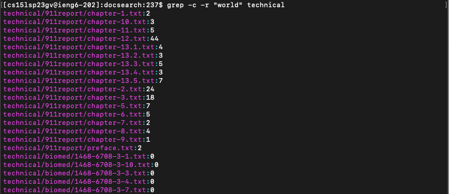
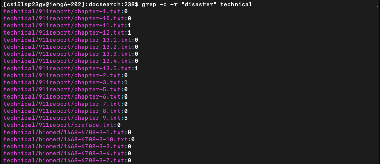
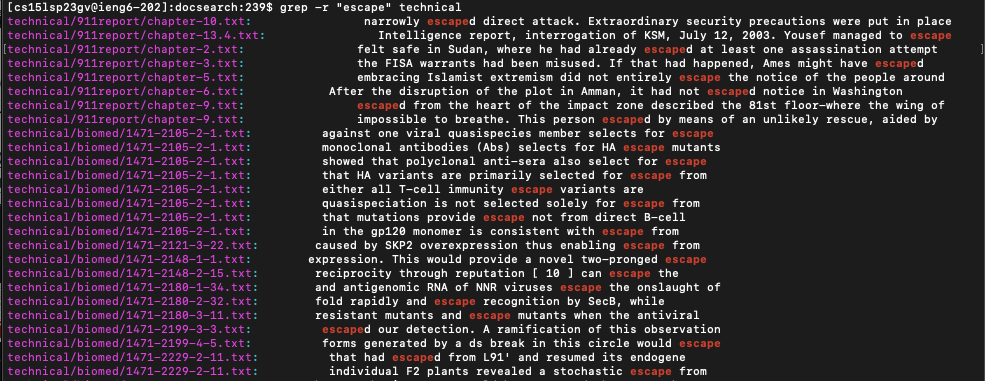
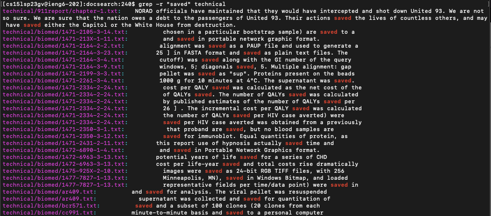
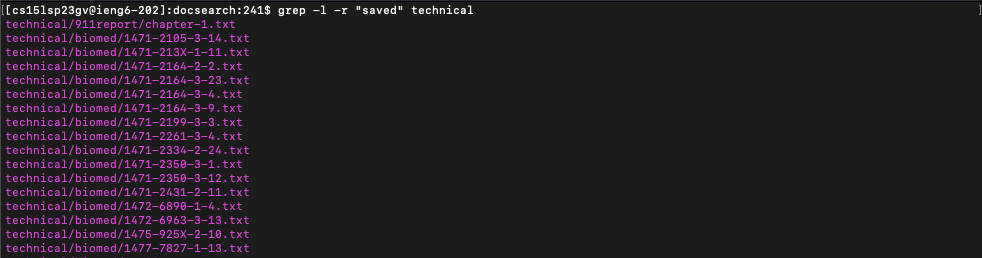

# **Lab Report - 3**
# **Researching Commands** 

## **Command Option 1: ```grep -c```**
The ```grep -c``` command option shows the number of lines in which a specific word appears in a file. It is used with ```-r``` to allow us to search through the files in technical. In the image below, you can see that the command prints out the name of each file that it checked and the number of lines that contain the searched word.

***Example 1:*** ```grep -c -r "world" technical```



In the above image, you can see that ```grep -c -r``` command goes through all th files in the directories of technical, and prints out the name of all the files along with the number of lines in which the searched string "world" appeared.

***Example 2:*** ```grep -c -r "disaster" technical```



Here, we can see that the ```grep -c -r``` command searches through all the files in technical for the string "disaster". It returns 0 for most of the files as they do not contain that string in any of the lines. But, you can see that it has returned 5 for one of the file as "disaster" must have appeared in 5 lines in that file. 

## **Command Option 2: ```grep -r```**
The ```grep -r``` command searches the directory and subdirectories for a specific string. Then, it prints out the path to the given file and the line in which the string appears.

***Example 1:*** ```grep -r "escape" technical```



In the image above, the ```grep -r``` command searches the directories and subdirectories of technical. As a result, it prints out the names of the files and the lines in which the specified string "escape" appears. We can see that the searched string is highlighted in red in the terminal.

***Example 2:*** ```grep -r "saved" technical```



In Example 2, we can see that ```grep -r``` searches technical for the string "saved". As a result, it returns the name of the file and also the lines which contain the specified string.

## **Command Option 3: ```grep -l```**
The ```grep -l``` command lists the files that are found to contain the specific String. It is used in combination with ```-r``` to allow us to search through the files in technical. The output only consists of the paths to the files that contain that String. It DOES NOT list the lines that contain the String. 

***Example 1:*** ```grep -l -r "saved" technical```



In the Terminal image above, the ```grep -l -r``` command gives all the directories and subdirectories of technical for "saved". 

***Example 2:*** ```grep -l -r "fire" technical```


Here we can see that the ```grep -l -r``` command gives all the directories and subdirectories as it did previously. All the files that contain the string "fire" are printed.

## **Command Option 4: ```grep -n```**
The ```grep -n``` command prefixes each line of output with the corresponding line number in that file. We use it in combination with ```r``` which will allow us to access all the files in technical.

***Example 1:*** ```grep -n -r "hero" technical```


In the Terminal screenshot above, we can see that the command goes through all the files in the directories and subdirectories of technical for the String "hero". As a result, it prints the paths, names, lines, and line number in the file in which the String "hero" is present.

***Example 2:***: ```grep -n -r "high" technical```


In the image above, we can see that the ```grep -n -r``` command prints the paths and names of all the files that contain the specified string. It also prints the lines and the line numbers where the String "high" is present.

